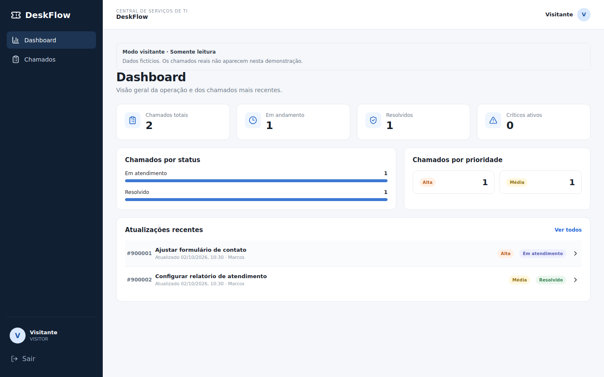
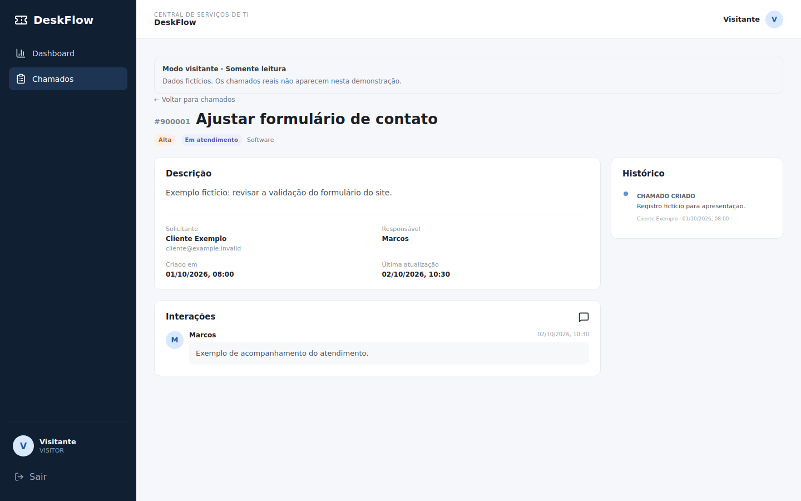
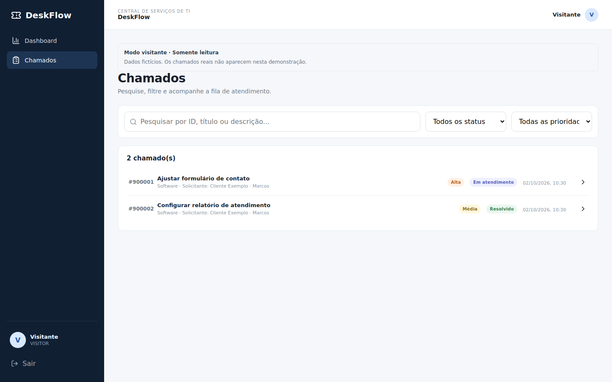
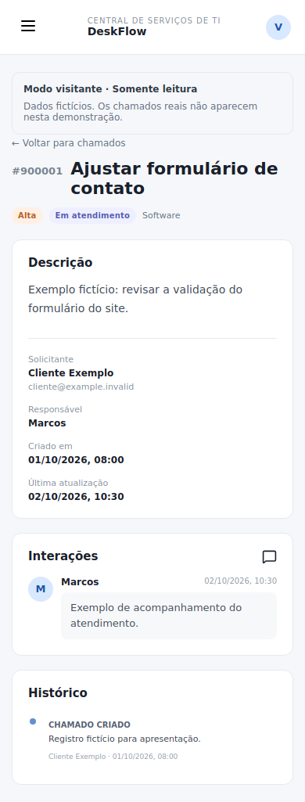

# DeskFlow

**Turn scattered support requests into a tracked workflow.** DeskFlow helps a support team prioritize tickets, assign ownership and keep updates in one place.

Next.js · React · TypeScript · Express · MySQL / SQLite · Docker



**[Watch the short product walkthrough](docs/media/deskflow-demo.mp4)** — dashboard, ticket list, conversation and mobile layout.

Real captures of the application running locally with isolated fictional visitor data. The interface is in Brazilian Portuguese. No customer records or credentials are shown.

## Features

- Create tickets with an asset, category and priority.
- Search and filter the queue; assign an agent and update status.
- Keep comments and a chronological history on each ticket.
- Review workload through dashboard totals and recent updates.
- Explore a separate read-only visitor demonstration.



<details>
<summary>More real screenshots: ticket queue and mobile view</summary>





</details>

## Try it locally

Requires Node.js 24 and npm.

```bash
git clone https://github.com/Santoszoi/deskflow-help-desk.git
cd deskflow-help-desk
npm run install:all
npm run setup
npm run dev
```

Open **http://localhost:3000** and choose **Entrar como visitante**. No password is needed for this isolated read-only mode. For the editable workflow, use the local [demonstration accounts](docs/SETUP.md#staff-demonstration-accounts).

**[Open the hosted demonstration](https://deskflow-help-desk-app.netlify.app/)**. Netlify team login is no longer required to load the site. The application retains its own access controls.

## Engineering decisions

| Decision | Reason and trade-off |
| --- | --- |
| Separate Next.js UI and Express API | Separate the interface from authorization and database logic; deploy independently. This adds routing and two services to operate. |
| MySQL for hosting; SQLite locally | Hosted records survive API deployments; SQLite simplifies local setup. Both execute real parameterized queries and require separate validation. |
| Server-side authorization | The API checks JWTs, requester ownership and staff permissions. Hidden interface controls are only a usability measure. |
| Isolated visitor fixtures | Review the interface without reading operational tickets or allowing writes. This mode does not demonstrate database persistence. |

Read the [architecture and permission model](docs/ARCHITECTURE.md) for code references and limitations.

## Verification and documentation

The repository includes API, browser, MySQL persistence and TLS tests. See [GitHub Actions](https://github.com/Santoszoi/deskflow-help-desk/actions) for the latest results.

- [Setup, Docker, environment variables and demo accounts](docs/SETUP.md)
- [Architecture, data flow and authorization](docs/ARCHITECTURE.md)
- [Deployment and migration notes](docs/DEPLOYMENT.md)
- [Validation scope and limitations](docs/VALIDATION.md)

This is a portfolio application. Public demo accounts are unsuitable for real customer data. A complete production-security or accessibility audit is not claimed.

## Author

**Marcos Neves** · Brasília, Brazil

[Portfolio](https://marcossolutions.com.br) · [LinkedIn](https://www.linkedin.com/in/marcos--neves) · [Email](mailto:marcosrony.neves@gmail.com)
